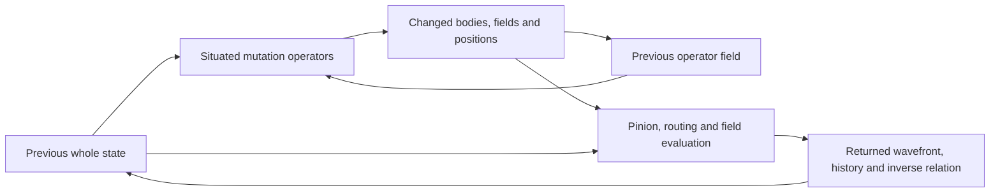

# Dawnwood architecture study

24 September 2026. This study reads the proposal as a computing architecture: the evolving object includes executable operators, their spatial definitions, their locations, routing and recurrent state. Its purpose is to preserve that object while making the implementation and evidence inspectable. The accompanying [source-to-kernel map](SOURCE_TO_KERNEL.md) identifies the current numerical choices and remaining differences.

## The source documents have different roles

The source also supplies an executable **authoring application**, now restored
under [source_workbench](../source_workbench/README.md). Its editable model and
cycle are not consumed by the current native runtime. The
[literal application contract](LITERAL_APPLICATION_CONTRACT.md) connects the
document requirements to that application and identifies the missing numerical
integration.

Page numbers below mean **physical PDF pages**, counting the cover. The early formalization's printed page number is one lower after its cover.

| Document | What it contributes | How to read it |
|---|---|---|
| [Original discussion, 24 pages](../double-slit-theory.pdf) | The author's progression from paired slits and pinions to a self-referential SDF operator substrate, especially pp. 3, 8, 12 and 14. | Distinguish turns marked **You** from generated responses marked **Google Search**. An affirmative generated response is not an experimental result or an additional author-specified equation. |
| [Early technical formalization, 20 pages](../Dawnwood_Interactive_Formalization.pdf) | Explicit proposed types, mathematical helpers and a bounded reference profile. | Its `[S]`, `[P]` and `[B]` labels distinguish source statements, proposed choices and background. It supplies one interpretation, not the complete source architecture. |
| [Unified definition v0.2, 18 pages](../Dawnwood_Interactive_Unified_v0.2.pdf) | A connected symbolic definition that keeps numerical laws open where the source did not specify them. | This is the reference for the whole circulation. It explicitly includes operator bodies, fields and positions as evolving records. |

These documents are related, but not interchangeable releases of one fully fixed equation. The early document separates a finite interpreter from continuous helpers. Unified v0.2 instead connects the named relationships in one expression model. The later [DWI-N1-0.5 formalization][formal] supplies a numerical implementation with its own declared bindings.

## The object that computes also changes

Unified v0.2 p. 3 writes the complete circulating state as

\[
S_n=(K_n,W_n,L_n,B_n,C_n),\qquad
S_{n+1}=\mathfrak D_\Psi[S_n;j_n],\quad j_n\in\{0,1\}.
\]

Here `K` is the Klein surface relation, `W` the wavefront, `L` the executable operator field, `B` its implicit routing relationship and `C` the retained texture state. They are coordinates of a common definition. The important closure is that `L` occurs on both sides: a computed state can change the definitions that produce a subsequent state.

A situated operator is `O = (body, field, position)` (Unified p. 9). Its location and scalar field participate in how its body acts; it is more than an instruction with a decorative coordinate. The same circulation can change its executable body, field expression and position. The operator that changes bodies is itself represented in the operator field, with its preceding record used to produce the next field.

The arrows describe temporal dependencies; they do not imply instantaneous evaluation of a recursively expanding expression. A preceding state supplies the definitions used to construct the next one. Unified pp. 9 and 13 make this explicit.

A fixed evaluator can execute genuine self-modifying programs. Its existence does not erase the distinction between a mutable program and a fixed one. The relevant questions are **which definitions are represented in the field, which can change, what changes them, and whether the changed definitions actually control later execution**. The current native implementation answers those questions for a restricted instruction vocabulary; it does not close every native rule into the field.

## How the relationships belong together

**Double pinion and Hadamard mitosis.** The original author's p. 3 introduces two pinions and Hadamard hinges. Unified p. 5 describes paired streams, `H_phi[W] = (W0,W1)`, followed by a paired action situated in `K` and `L`. The pair persists through the circulation, carrying both state and changing operators. It is not exhausted by a one-time initial split. Its exact phase-dependent mixing and transport laws remain named bindings in that edition.

**Log-polar encoding.** Unified p. 6 assigns the encoding a role in operator positions, selection and movement as well as wavefront values. Radius and phase are coordinates of the computational relation, not merely display coordinates. The document leaves the log base, bins and numerical phase representation open. The source's `[0,2,0,1]` at p. 6 is a literal wavefront instance; it supplies no general timestamp-to-wavefront algorithm.

**Klein return.** Original pp. 12–15 and Unified pp. 9–10 connect the non-orientable return to recurrent input and route reversal. A chart coordinate is a way to represent that relationship, not a requirement for a square image field. The distinction between an intrinsic quotient, an embedding, a scalar operator field and a globally defined distance function matters when implementing the named SDF. The topology has a computational role when its transported orientation changes selection or action.

**Binary routing.** Unified p. 10 makes the implicit relation concrete: `child(i,b)=2i+1+b`; reversal may replace `b` with `b XOR sigma`. The tree determines access to situated definitions. This integer addressing relation does not by itself specify a distance comparator or a geometrically self-growing tree.

**Geometry, double dot and phyllotaxis.** The author's original p. 8 places T, pyramid side view, circle, cone, sphere and apex together with the colon product, phase differential, phyllotaxis and blend. Unified p. 8 keeps these as connected operator actions and positions. The colon's operand types and product law are open bindings, not automatically an ordinary dot product. Phyllotaxis participates in spatial arrangement; a claim of useful execution locality still requires the corresponding schedule and measurements.

**PSI, jitter and the fourth slot.** Unified p. 7 makes jitter act on operator-bearing state, rather than only on an external input. Its RK4 expression preserves the author's two Y-up events in the fourth slot. The derivative, displacement and interval need numerical bindings. A structure with four slopes is not alone evidence that a chosen modified scheme has fourth-order convergence.

**RGBA and inverse T.** Unified p. 11 uses R/G for the paired streams, B for history and kinematic context, and A for the inverse relation. Its initial choice is inverse transformation, while the original discussion considered other T meanings. These are semantic roles; they need not fit one four-scalar display pixel. Optional output follows the returned state and does not define its computation.

## Double Hadamard and double packing require precise meanings

The early formalization, physical p. 6, Eq. 7, proposes an explicit two-Hadamard mixer:

\[
U(\phi)=H\,\mathrm{diag}(1,e^{i\phi})\,H.
\]

Unified p. 5 preserves the phase-dependent hinge as a named action instead of requiring that matrix. The current numerical kernel uses a different transform, documented in the [implementation map](SOURCE_TO_KERNEL.md#the-two-hadamard-difference). Neither the two-pinions vocabulary nor two complex channels alone establishes that two H matrices execute per epoch.

The phrase **double packing** has no single complete codec definition in the reviewed documents. It could refer to paired/dichromatic state, operator definitions packed into a LUT/tree, two layers of representation, or a later author-intended composition. Those possibilities must not be silently equated. Original pp. 18–23 discuss resident LUT/state storage, BC5 and removal of explicit tree pointers. Unified pp. 14–15 labels the capacities hypothetical and preserves an undefined bytes-per-operational-state value for the 24–48 billion scenario. Current double buffering is an execution mechanism, not evidence of a second compression factor.

## Specialization inside this architecture

The design permits a broader question than whether its dynamics can feed a conventional predictor. A specialization can give meanings to the situated fields, encode a domain's admissible relations, and represent rules that transform other rules inside the same evolving object. The output then reports a computational decision or changed constraint system, rather than treating the field merely as a source of features.

For example, a **proposed computational SDF profile** could represent an admissible operating region by signed fields, use operator composition to determine feasibility, and represent a metarule as a situated operator that changes a region's offset or another operator's action. Input state would determine which metarule applies; the next decision would use the changed field. A useful observation would identify the governing constraint and show how that change alters subsequent admissibility. This is a concrete specialization proposal, not a claim that DWI-N1 already supplies its complete semantics.

Such a profile should declare what the sign, distance, position, body, input and returned decision mean. It should expose the mutation mechanism and preserve enough state for replay. It should also distinguish a true distance field from an arbitrary scalar expression after composition. These contracts make an executable geometric computation reviewable without requiring a standard machine-learning architecture.

Unified p. 13 places logic, iteration, program change, neural weights/activations and database relations in the same expression vocabulary. That is an intended scope, not a supplied compiler for all those workloads. A specialization succeeds when an explicit problem is expressed, its operators execute with declared semantics, and its returned result has a checkable meaning.

## What the hardware campaign establishes

The [RTX campaign](../output/rtx5070ti_laptop_2026-09-24/REPORT.md) establishes execution, memory capacity, sustained load and CPU/GPU agreement for identified workloads and the DWI-N1-0.5 profile. It does not decide the usefulness of every source relationship or prove that this binding exhausts the proposed architecture. Conversely, implementation gaps do not make the central code/state/geometry closure disappear. The next practical work should expose those mechanisms directly and label each further operational choice.

The optional [DWI-D1-0.1 native domain extension](DOMAIN_KERNEL.md) now implements one such choice: actual task coordinates and protected affine laws inhabit the same state/LUT, the mutable situated controller regulates correction, and domain error returns to geometry and later mutation. Its enzyme-pool, buffer-window, resource and toy flux examples have their own execution evidence. This is an explicit computational specialization of the existing recurrence; it does not establish the full proposed closure or substitute D1 results for the earlier N1 campaign.

[formal]: ../Dawnwood_GPU_Kernels_GTX1650Ti_POCO_X7_Pro_v0.3/Dawnwood_GPU_v0.3/docs/FORMALIZATION_v0.5.md
