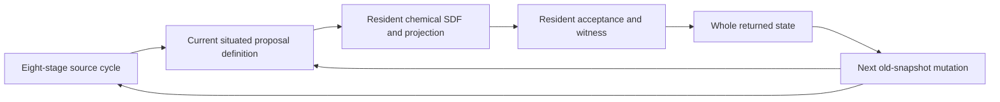

# Resident enzyme-pool reconciliation

`DWI-ENZYME-0.1` is a computational application of the [eight-stage numerical source cycle](SOURCE_CYCLE_BINDING.md). Given four supplied concentrations and two conserved totals, it returns an approximately reconciled enzyme/substrate candidate with feasibility and numerical accuracy diagnostics. Its proposal, chemical signed distance, projection, objective, acceptance and returned witness execute as resident expression definitions. The host prepares the definitions and input data; it does not solve or project the observations during execution.

The [generator](../local_lab/source_enzyme.py) extends the existing `blend` source record, index 14, with typed application roles. It preserves the original 31 records, their source-slot assertions and the complete original eight-stage action sequence. This is an authored numerical specialization of `Math_blend`, not a claim that the original source uniquely specified biochemical equations. The Unified document supplies the body/field/anchor structure and old-state mutation relationship on page 9, the whole-cycle return on page 12, and the distinction between declared architecture and open numerical bindings on page 16. See [Unified v0.2](../Dawnwood_Interactive_Unified_v0.2.pdf).

## What the result means

The supplied mechanism is the closed, fixed-volume pool model `E + S ⇌ ES → E + P`. The conserved quantities are `E + ES = E_total` and `S + ES + P = S_total`. All four species must be nonnegative. Observations may violate these equations or contain negative readings; the application reconciles those readings under the explicitly supplied model. It does not estimate reaction rates, simulate biochemical time, infer whether this mechanism describes an actual sample, or establish clinical meaning.

The equal-weight objective is the squared discrepancy between the four returned and observed concentrations, after dividing every concentration by the same positive reference scale. That metric is a deliberate assumption. The [domain grounding](ENZYME_POOL_DOMAIN_GROUNDING.md) derives the conservation plane, induced metric, exact distance and independent reference problem. Unequal measurement uncertainties would require a separately declared weighted metric and new bindings.

For normalized complex concentration `c = ES / scale` and product `p = P / scale`, the four-species point is

`x(c,p) = (ET − c, ST − c − p, c, p)`, in the order **E, S, ES, P**.

The intrinsic coordinates are `y = (sqrt(5/2)c, (c + 2p)/sqrt(2))`. Euclidean distance in `y` equals Euclidean four-species distance within the conservation plane. Nonnegativity defines a convex trapezoid. The resident SDF computes the minimum distance to its four finite line segments, with a negative sign inside. It also returns a nearest boundary witness. Projection preserves an inside proposal and uses that boundary witness only for an outside proposal. Calling a nearest *boundary* point a nearest feasible point for an interior query would be incorrect; the two are explicitly distinguished.

This is a signed distance in the two-dimensional conservation plane, not a signed solid with interior in four-dimensional concentration space. Its exactness describes the real-arithmetic formula. The executable evaluates that formula approximately in FP32.

The nearest boundary coordinates are intermediate outputs of resident role 101. The final checkpoint exports the accepted four-species witness and numerical diagnostics; it does not retain a separate nearest-boundary coordinate pair or edge identifier.

## Carrier, chemical field and resident strategy

The `blend` record retains its own editable Klein placement and intrinsic carrier-disk field. An additional resident body role computes the chemical SDF. Concentrations are never identified with Klein `u,v`, and the carrier disk is not relabelled as biochemical geometry. Current placement and carrier distance affect the computational proposal step; they do not change conservation totals, the chemical metric or the acceptance law.

| Role | Resident definition | Purpose |
|---|---|---|
| 0 | Existing `blend_role0` | Preserve the original source-cycle blend. |
| 100 | Fast or cautious proposal | Move the current intrinsic point toward the observation's unconstrained plane target. |
| 101 | `enzyme_domain_sdf` | Evaluate signed chemical distance and nearest boundary witness. |
| 102 | `enzyme_project_evaluate` | Project an outside proposal and evaluate all four species. |
| 103 | `enzyme_accept` | Accept a negative computed quadratic difference or retain the incumbent. |
| 104 | `enzyme_witness_gap` | Return physical concentrations, objective and a convex-gap estimate. |

The two compatible body families share **the same function handles** for roles 0 and 101–104. Only proposal role 100 differs. The compiler checks this identity across every family with the `blend` interface, beyond the generic runtime's signature check. The validated bank and family role maps remain immutable during execution; the live record's body handle selects the current compatible family.

This protects the supplied scientific law while allowing the computational strategy to change. It is finite resident program selection, not unrestricted expression synthesis. An intentional new mechanism or metric requires a new explicit binding; it must not be presented as the current mutation mechanism discovering different physical constants.

## Connected recurrence

The original cycle runs first: mutation and Klein update, log-polar encoding, split/two-Hadamard hinge, selected operator, four dependent RK stages with the configured fourth-slot events, geometry/divergence, typed RGBA, and pinion/return. The application calls are appended inside the final `surface_return` stage. The original 44 state writes remain provisional until the entire resident epoch commits, so a later VM failure rolls them back together with the domain work.

The current returned complex pair, all four phase-history values, all four inverse-matrix entries, interval and the `blend` record's current carrier distance control a bounded proposal step. The fast family uses a step in `[0.45, 0.90]`; the cautious family uses `[0.10, 0.35]`. These are computational search parameters. The original `PSI` interval has no biochemical time calibration.

The chemical candidate is projected and evaluated by the current resident definitions. Acceptance uses the intrinsic quadratic difference

`DeltaJ = 2 (y_old − y_target) · (y_candidate − y_old) + ||y_candidate − y_old||²`.

This is exactly the full four-species objective change in real arithmetic. Evaluating the difference directly avoids subtracting two large objectives that share a constant error normal to the conservation plane. A negative difference accepts the candidate; otherwise the old feasible point survives. Ordinary rejection does not fail or freeze the resident epoch. Full four-species objective values are separately recomputed for reporting.

The accepted point, concentrations, improvement, trial distance and acceptance flag return in the same state. At the next epoch, the **old** mutation definition reads those preceding values to choose the next `blend` strategy. The mutation record's control additionally receives

`0.02 sin(prior_trial_distance) + 0.01 sin(prior_improvement) + 0.01 (2 prior_accepted − 1)`.

This bounded increment gives subsequent core hinge decisions a path from chemical feedback, while preserving old-snapshot publication and the existing mutation controller's self-change. In the recorded ablation, core waves are unchanged through 128 epochs but differ in 45/129 cases at epoch 2,048; accepted concentrations remain unchanged in that plateaued comparison. This is conditional delayed coupling. Bounded increments do not imply bounded accumulated control or a global stability proof.



The 20 remaining state words hold four normalized observations, two accepted intrinsic coordinates, objective, raw-trial distance, improvement, acceptance, four concentrations in uM, gap estimate, step, two raw-trial coordinates, projection distance and previous objective. The original 44 source-state words retain their original meanings. Each lane owns its complete state and operator table; the population is not one shared chemical system.

## Inputs and execution

The [example inputs](../source_bindings/examples/enzyme_inputs.json) include inconsistent, negative, feasible and boundary observations. The strict input profile supplies common `E_total_uM`, `S_total_uM`, `concentration_scale_uM` and individually named observations. This edition requires `0 < E_total < S_total`; its documented numerical bounds exclude degenerate polygon edges and extreme normalized magnitudes.

```powershell
.\Dawnwood-Enzyme.cmd compile --inputs source_bindings/examples/enzyme_inputs.json --output output/my_enzyme
.\Dawnwood-Enzyme.cmd run --backend vulkan --epochs 128 --input output/my_enzyme/program.bin --output output/my_enzyme/gpu128.bin
.\Dawnwood-Enzyme.cmd results output/my_enzyme/gpu128.bin --manifest output/my_enzyme/manifest.json --output output/my_enzyme/results.json
```

Use `--backend cpu` for the same generic interpreter on the CPU. A returned checkpoint contains the complete bank, plans, records and state and can be supplied as the next run's input. The exporter reports stored results and directly checks residuals; it does not repair them.

Every lane starts at the explicit feasible corner `ES=P=0`, `E=ET`, `S=ST`. This is a common initializer, not an observation-dependent host solution. Trial, acceptance and gap diagnostics are unevaluated at epoch zero. The first committed epoch computes them from resident definitions.

## Accuracy and evidence

The gap field evaluates `max_vertex grad(J) · (y − vertex)`, clamped below by zero. In exact arithmetic, for a feasible point this upper-bounds objective suboptimality. The FP32 number is an **estimated bound**, not a rigorously rounded certificate. Small reported gap alone does not certify accuracy against the original unrounded inputs; independent feasibility and reference-solution checks are required. A finite run returns an approximate reconciled witness and does not automatically earn an “exact nearest composition” claim.

FP32 boundary projections can retain a small normal displacement. Its contribution to the quadratic-difference evaluation can obscure a much smaller improvement along the boundary, so the recurrence can plateau with a nonzero gap. Removing the large constant normal error from acceptance improves this behavior but does not eliminate all cancellation. More epochs are therefore not a guarantee that an arbitrarily requested tolerance will be reached. The result must retain the measured residual and unresolved-gap status instead of silently substituting a host-corrected composition.

Rounding can also change the sign of a very small true objective difference. An independent focused boundary audit observed accepted tiny increases as well as rejected tiny decreases. The acceptance rule is therefore a computed FP32 decision, not a guarantee of monotonic improvement against exact input mathematics.

The [application campaign](../output/resident_enzyme_2026-09-24/REPORT.md) separates full-cycle execution, independent domain mathematics and deliberate interventions:

- All 129 synthetic cases remain runtime-healthy and feasible within `1e-5` normalized tolerance in the recorded runs. CPU/GPU checkpoints agree byte for byte, including continuation and reversed mutation target order.
- After 128 epochs, maximum species error against an independently solved constrained optimum is `4.337e-4` normalized units, or `0.004337 uM` at the recorded `10 uM` reference scale. Reported gap estimates can remain above the requested threshold.
- Interventions in each of the eight source stages and in carrier field and placement each change accepted concentrations in 108/129 cases. Freezing the mutator's successor changes accepted domain state in 81/129 cases by epoch 2.
- The [delayed-feedback comparison](../output/resident_enzyme_2026-09-24/long_feedback_audit.json) distinguishes the eventual core-wave effect from unchanged accepted concentrations. A changed controller word alone is not counted as a changed application answer.
- The [authoring rejection campaign](../output/resident_enzyme_2026-09-24/rejections/REPORT.md) rejects 58 representative malformed input, source-shape and protected-law-mapping cases; its valid control compiles successfully.

The compile bundle preserves exact model, cycle and input bytes, the generator and base-cycle dependency, explicit function bodies, call plans, protected-law hashes, source phase boundaries and state meanings. Earlier source-cycle CPU/GPU and saturation evidence remains separate from these application results. Neither campaign demonstrates a speed advantage over a direct small convex solver or validates an experimental biochemical model.
