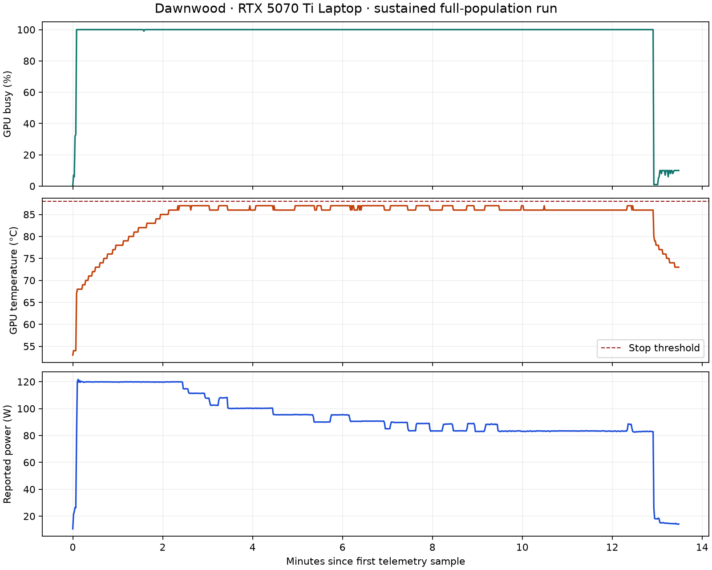

# Dawnwood RTX 5070 Ti Laptop — completed campaign

24 September 2026 · Runtime **0.5.1-rtx1** · Numerical profile **DWI-N1-0.5**.

The RTX edition is built, numerically checked, capacity-tested and sustained-load
tested on the physical MSI Vector 16 HX AI A2XWHG. NVIDIA reports an RTX 5070 Ti
Laptop GPU, 12,227 MiB framebuffer and driver 591.59. The host has
16,558,415,872 bytes of system RAM. No clock, power-limit or cooling setting was
changed. The firmware's observed power/thermal controls remained active.

## Measured results

| Measurement | Result |
|---|---:|
| Final binary versus baseline, median GPU time, 1,048,576 states × 64 epochs | 5.749778 s versus 6.306470 s |
| Throughput improvement in that paired comparison | **9.68%** |
| Largest completed single connected population | **43,609,664 full 128-byte states** |
| State ping-pong payload | 10.397 GiB |
| Sustained run | **177 epochs; 7,718,910,528 state updates** |
| Sustained device time | **12.81 minutes** |
| Sustained whole-process time | 13.49 minutes |
| Sustained throughput | 10.041 million state updates/s |
| Peak sampled GPU utilization | 100% |
| Samples at ≥95% GPU utilization | 763, sampled approximately once per second |
| Peak reported VRAM usage | 10,935 MiB |
| Peak sampled temperature / power | 87°C / 121.70 W |
| Measured child-process peak host working set | 86.89 MiB |
| Maximum sampled child-process private commit | 10.800 GiB |

The final sustained run completed successfully and read back and health-checked
all 43,609,664 records: no nonfinite state values or invalid records.
The maximum energy deviation from the source norm of five was
5.96046e-05. Health is distinct
from CPU/GPU numerical equivalence.

The host working set measures resident pages. Windows still reports substantial
private commit during the large Vulkan allocation; bounded application staging
does not mean the driver needs only the resident working-set amount of backing
store. Both measurements are retained above and in the raw receipt.

**Cooling limits sustained performance.** Software thermal slowdown was active
in 623 samples. The firmware reduced clocks and power while the
GPU remained busy. The raw trace retains this behavior; the short paired
benchmark is not represented as an indefinitely sustainable rate. The earlier
selection campaign measured a 10.54% throughput improvement on its workload;
`final_paired_bench.json` records the exact shipped executable's subsequent
paired comparison under the post-stress laptop conditions.



## Correctness and storage evidence

The existing 17 Python checks, 30 CPU fixtures, 29 active-operator sensitivity
checks and checkpoint replay pass. The final executable compares every state
and operator word after every epoch in these workloads:

| States | Operators | Epochs | Result |
|---:|---:|---:|---|
| 257 | 31 | 4,096 | Zero bit differences; zero layer errors/warnings |
| 4,096 | 31 | 256 | Zero bit differences; zero layer errors/warnings |
| 1,048,577 | 31 | 2 | Zero bit differences; zero layer errors/warnings |
| 257 | 511 | 128 | Zero bit differences; zero layer errors/warnings |
| 257 | 31 | 128 | Zero bit differences; zero layer errors/warnings |

All listed comparisons enable Khronos core and explicitly requested
synchronization validation. They retain the original `atol=1e-5`, `rtol=2e-5`
and exact integer checks; zero bit differences are separately measured.
Forced page boundaries cover mutation feedback and both monolithic/staged
evolution. The 1,048,577-state comparison crosses the new dispatch boundary.

Normal, streamed and preceding-build 8,190-state × 16-epoch checkpoints are
byte-identical (`paged_checkpoint_identity.json`), as is the final executable's
`final_launcher.dwk`. At the full capacity count,
default and alternate page layouts produce the same full-population digest,
with zero core/synchronization errors and warnings
(`large_page_layout_identity.json`). That digest comparison is not a full-size
CPU reference comparison.

## What changed

- Measured RTX defaults: 32 lanes per workgroup and 1,048,576 states per dispatch.
- Two physical pages represent one logical state buffer. All pages share one
  mutation and one changed LUT per epoch. This removes the previous ~8 GiB
  ping-pong storage limit; it does not create independent populations.
- Initialization and full readback use an 8 MiB host-state chunk instead of a
  full host-state snapshot. Vulkan staging remains bounded at 16 MiB; driver,
  compiler, executable and operator storage are additional.
- The numerical equations, source vector, operator bodies, topology, fourth-slot
  double Y-up, inverse/history semantics, tolerances and checkpoint ABI remain
  unchanged. The profile remains DWI-N1-0.5.

## Scope and limits

Capacity stopped at the **current Vulkan-budget policy**: 98% of reported free
budget minus a 32 MiB reserve. It is not an absolute hardware maximum. The
operating system and driver reserve part of physical VRAM. Every capacity
candidate performs four real epochs and complete readback; allocation alone is
not counted as success. The sustained run uses the same largest population.

GPU timestamps exclude initialization, upload, full readback and host gaps.
Whole-process time includes them. Streamed readback includes incremental hash
and health work; its reported analysis time is an overlapping subinterval.
NVML telemetry is device-wide at approximately one-second intervals. Busy
percentage does not establish instruction-unit occupancy, cache residence,
memory bandwidth saturation, or peak theoretical FLOPS. Ordinary desktop load,
dynamic clocks and cooling are uncontrolled and retained in the evidence.

The sustained run has layers disabled for timing; the identified correctness
and full-size alternate-layout runs have them enabled. No device reset, thermal
stop or kernel failure occurred in the completed sustained run. This finite
campaign is not indefinite endurance qualification or an all-input proof.
The new edition is tested on this RTX laptop; old GTX/phone artifacts remain
historical. Physical and universality claims are not extended by these results.

The first final-suite launch failed in its Python memory-accounting helper,
which still assumed a 65,536-state dispatch cap. The helper was updated to the
runtime's actual configurable bound; `final_claims_r2/` passes. The failed
attempt is retained under `final_claims/` and `final_claims.stderr`.

The first launcher check was rejected by Windows PowerShell's existing script
execution policy before starting the runtime. PowerShell 7 runs the launcher
successfully (`final_launcher_r2.*`). No execution policy was changed. Direct
execution of the supplied `.exe` is also supported.

## Identity and reproduction

Executable SHA-256: `cb6b069a2082b2ee55cdf57a8332d4c1904f2190ba4061a416f63c6d83911015`.

Shader-source fingerprint: `987876327c465410afb8b702d50a42ad030d1fa26028ca14805278c32dc37a7b`.

`completion_audit.json` records the executable, every embedded shader, the exact
verification scope and measured metrics. Commands, environment, exit codes,
stdout/stderr, capacity policies, timings and telemetry are retained here.
The package root manifest covers source, binary, tools, documentation and these
records. Build inputs are documented in `WORKING.md` and the build receipts.

From the standalone package root:

```powershell
.\kernel\bin\windows-rtx5070ti\dawnwood.exe run --device 'RTX 5070 Ti' --stream --count 1048576 --steps 64 --batch 8 --budget-fraction .98
.\kernel\bin\windows-rtx5070ti\dawnwood.exe verify --device 'RTX 5070 Ti' --count 257 --steps 4096
python kernel\tools\measure_capacity.py --binary kernel\bin\windows-rtx5070ti\dawnwood.exe --device 'RTX 5070 Ti' --stream --budget-fraction .98 --reserve-mib 32 --steps 4 --out my_capacity
python tools\verify_manifest.py
```

Use a new capacity output directory. The runtime guide explains validation-layer
setup, checkpoint/resume, tuning overrides and the CMake/LLVM build commands.
